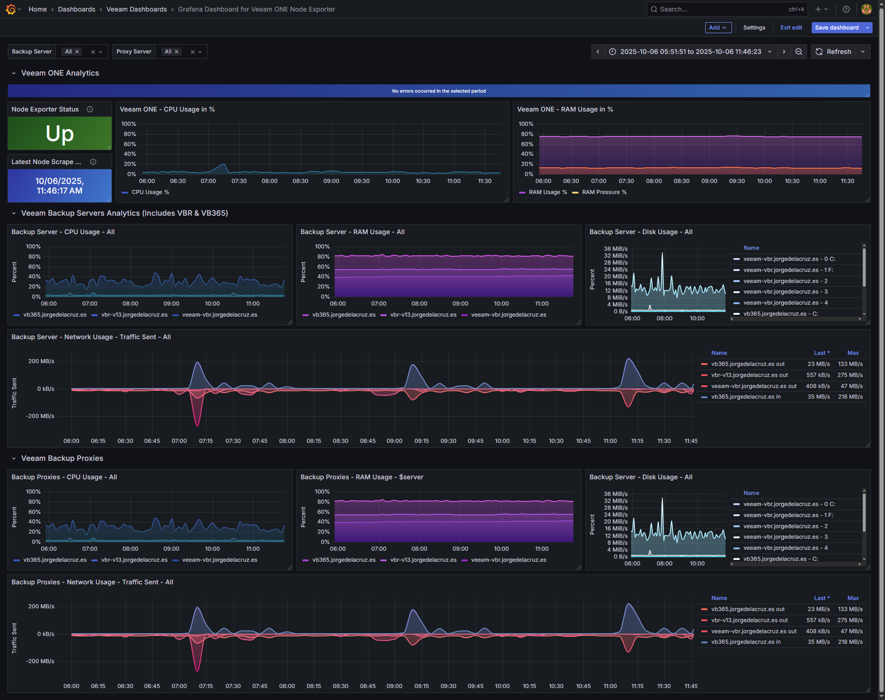

# VONE Exporter for Prometheus (Windows)

Prometheus exporter that reads recent performance counters from a Veeam ONE database and exposes them at `/metrics`.

- Metrics: `*_net_bytes_sent_per_sec`, `*_disk_bytes_per_sec`, `*_cpu_usage_percent`, `*_memory_used_bytes`
- Labels: `host`, plus `iface` for network and `disk` for disks
- Format: Prometheus text exposition
- Endpoints: `/metrics` and `/debug`
- Default listen URL: `http://127.0.0.1:9108/`

## Screenshot



After you finish the tutorial, and when you send the metrics to some database, for example InfluxDB, you can have a view like this, built using InfluxDB v2, and telegraf as collector.

## Requirements

- Windows 10 or later, or Windows Server 2019 or later
- .NET 8 SDK for building
- No runtime required if you use the self contained release binary

## Quick start on Windows

1) Download the latest Windows ZIP from the Releases page once you have published one.
2) Extract to a folder, for example `C:\vone-exporter`.
3) Copy `appsettings.example.json` to `appsettings.json`. Edit the connection string to your Veeam ONE SQL Server. Use a read only login.
4) Run the exporter:
   ```powershell
   cd C:\vone-exporter
   .\VoneExporter.exe
   ```
5) Browse to `http://127.0.0.1:9108/metrics` and confirm you see metrics.

### Allowing remote scrape

If Prometheus scrapes from another host, change `ListenUrl` to `http://0.0.0.0:9108/` in `appsettings.json`, then allow the port in Windows Defender Firewall:

```powershell
netsh advfirewall firewall add rule name="VONE Exporter 9108" dir=in action=allow protocol=TCP localport=9108
```

If you see `HttpListener failed` about URL ACL, reserve the URL once:

```powershell
netsh http add urlacl url=http://0.0.0.0:9108/ user=Everyone
```

## Configuration

`appsettings.json` must live next to the executable.

```json
{
  "Exporter": {
    "ListenUrl": "http://127.0.0.1:9108/",
    "PollSeconds": 60,
    "LookbackMinutes": 15,
    "SqlConnectionString": "Server=YOURVONESERVER;Database=VeeamOne;Trusted_Connection=True;Encrypt=True;TrustServerCertificate=True;",
    "MetricPrefix": "vone_exporter"
  }
}
```

Notes:
- On production systems use a proper server certificate and set `TrustServerCertificate=False`.
- Create a least privileged SQL login that can read the `monitor` schema only.
- By default the JSON config uses Windows Auth, considering this .exe is stored on the VONE Server itself.

## Example of the Node Exporter Response

You should see something similar to this once you have your .exe up and running and you hit http://YOURIP:9108

```yaml
# HELP vone_exporter_up Exporter health
# TYPE vone_exporter_up gauge
vone_exporter_up 1
# HELP vone_exporter_last_scrape_success_seconds Unix time of last successful scrape
# TYPE vone_exporter_last_scrape_success_seconds gauge
vone_exporter_last_scrape_success_seconds 1759418910
# HELP vone_exporter_last_scrape_error_info Last scrape error info (0 means none)
# TYPE vone_exporter_last_scrape_error_info gauge
vone_exporter_last_scrape_error_info{message="none"} 1
# HELP vone_exporter_net_bytes_sent_per_sec Network bytes sent per second
# TYPE vone_exporter_net_bytes_sent_per_sec gauge
# HELP vone_exporter_disk_bytes_per_sec Disk bytes per second
# TYPE vone_exporter_disk_bytes_per_sec gauge
# HELP vone_exporter_cpu_usage_percent CPU usage percent
# TYPE vone_exporter_cpu_usage_percent gauge
# HELP vone_exporter_memory_used_bytes Memory used in bytes
# TYPE vone_exporter_memory_used_bytes gauge
vone_exporter_memory_used_bytes{host="veeam-vbr.jorgedelacruz.es"} 10452789292 1759418700000
vone_exporter_disk_bytes_per_sec{host="veeam-vbr.jorgedelacruz.es",disk="4"} 0 1759418700000
vone_exporter_net_bytes_sent_per_sec{host="veeam-vbr.jorgedelacruz.es",iface="vmxnet3 Ethernet Adapter"} 463 1759418700000
vone_exporter_net_bytes_sent_per_sec{host="veeam-vbr.jorgedelacruz.es",iface="vmxnet3 Ethernet Adapter _2"} 0 1759418700000
vone_exporter_net_bytes_sent_per_sec{host="veeam-vbr.jorgedelacruz.es"} 463 1759418700000
vone_exporter_disk_bytes_per_sec{host="veeam-vbr.jorgedelacruz.es",disk="0 C:"} 11164139 1759418700000
vone_exporter_disk_bytes_per_sec{host="veeam-vbr.jorgedelacruz.es",disk="1 F:"} 0 1759418700000
vone_exporter_disk_bytes_per_sec{host="veeam-vbr.jorgedelacruz.es",disk="2"} 0 1759418700000
vone_exporter_disk_bytes_per_sec{host="veeam-vbr.jorgedelacruz.es",disk="3"} 0 1759418700000
vone_exporter_disk_bytes_per_sec{host="veeam-vbr.jorgedelacruz.es"} 11164139 1759418700000
vone_exporter_cpu_usage_percent{host="veeam-vbr.jorgedelacruz.es"} 22 1759418700000
vone_exporter_memory_used_bytes{host="vbr-v13.jorgedelacruz.es"} 11252932105 1759418700000
vone_exporter_net_bytes_sent_per_sec{host="vbr-v13.jorgedelacruz.es",iface="ens33"} 540 1759418700000
vone_exporter_net_bytes_sent_per_sec{host="vbr-v13.jorgedelacruz.es"} 540 1759418700000
vone_exporter_disk_bytes_per_sec{host="vbr-v13.jorgedelacruz.es",disk="sda"} 24254 1759418700000
vone_exporter_disk_bytes_per_sec{host="vbr-v13.jorgedelacruz.es",disk="sdb"} 587538 1759418700000
vone_exporter_disk_bytes_per_sec{host="vbr-v13.jorgedelacruz.es"} 611792 1759418700000
vone_exporter_cpu_usage_percent{host="vbr-v13.jorgedelacruz.es"} 3 1759418700000
```

## Prometheus scrape example

```yaml
scrape_configs:
  - job_name: "voneexporter"
    metrics_path: /metrics
    static_configs:
      - targets: ["your-windows-host:9108"]
```

## Telegraf scrape example

```yaml
[[inputs.prometheus]]
  urls = ["http://127.0.0.1:9108/metrics"]
  metric_version = 2
  name_override = "vone_exporter"
```

## Run as a Windows service

Use NSSM to run the console app as a Windows service. Full steps are in **WINDOWS-SERVICE.md**.

## Build from source on Windows

Assuming your `VoneExporter.csproj` is at the repository root and targets `net8.0-windows`.

```powershell
# restore
dotnet restore .\VoneExporter.csproj

# publish self contained single file for Windows x64
dotnet publish .\VoneExporter.csproj -c Release -r win-x64 --self-contained true -p:PublishSingleFile=true -o .\out\win-x64
```

Copy `appsettings.example.json` to `.\out\win-x64\appsettings.json`, edit, then run `VoneExporter.exe` from that folder.


## Security notes

- Bind to `127.0.0.1` unless a remote scrape is required.
- Use a low privilege service account when running as a service.
- Limit SQL permissions to read only on the needed tables.

## License

MIT or Apache 2.0 are both good choices for an exporter.
